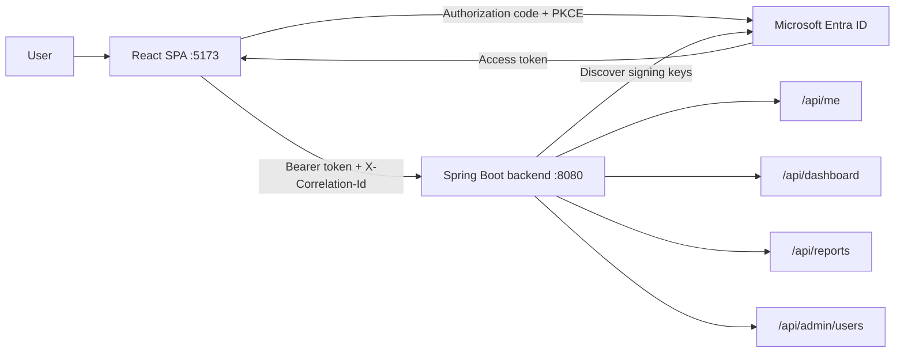
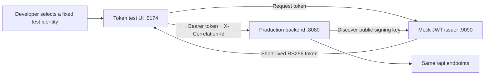
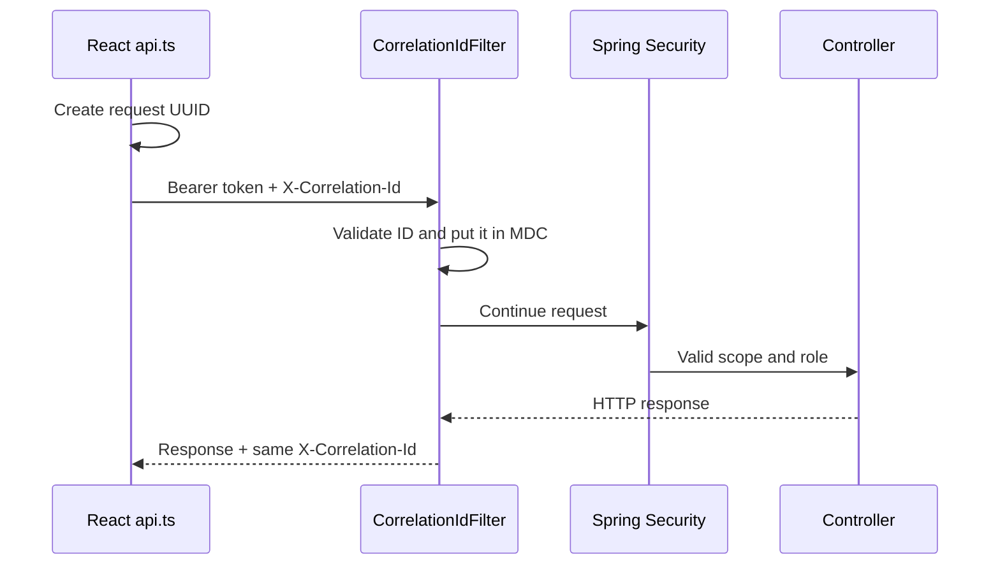

# Entra SSO React Spring Reference

A beginner-friendly, production-oriented Microsoft Entra SSO reference with one React SPA and one
Spring Boot backend application.

**Recommended GitHub repository name:** `entra-sso-react-spring-reference`

## What this repository demonstrates

- Java 25 and Spring Boot 4.1.1
- React 19, TypeScript, Vite, MSAL Browser, and MSAL React
- OAuth 2.0 authorization code flow with PKCE
- One backend that validates every received access token
- Entra delegated scope (`scp`) and application roles (`roles`)
- `/api/me` for UI identity, role, and functionality rendering
- `@PreAuthorize` authorization for dashboard, reports, and administrator endpoints
- OpenAPI-first Spring controllers and response models generated during the Maven build
- Exact-origin CORS, stateless APIs, and no custom authentication endpoint
- End-to-end `X-Correlation-Id` propagation and correlation-aware request logging
- Spotless/google-java-format for Java and Prettier for the React application
- JaCoCo 85% line-coverage gates, Checkstyle, SpotBugs, and Maven Enforcer
- Local OWASP Dependency-Check/npm audit commands and CycloneDX SBOM generation
- Automated tests for `401`, `403`, roles, CORS, `/api/me`, and successful requests
- Separate local JWT testing applications for development before Entra is available

## Simplified architecture



There is intentionally no Spring `/login`, `/authenticate`, or token-issuing endpoint. React uses
MSAL to sign in with Entra. Spring Boot is an OAuth2 resource server: its security filter validates
the access token before a generated controller invokes its application delegate.

Read [docs/architecture.md](docs/architecture.md) for the detailed sequence.

## Repository layout

```text
backend/
  src/main/openapi/
    entra-sso-api.yaml              Source of truth for HTTP paths and response schemas
  src/main/java/com/example/entrasso/
    EntraSsoApplication.java
    security/                       JWT, CORS, role conversion, and /api/me delegate
    logging/                        Correlation-ID filter and HTTP request logs
    api/                            Dashboard, reports, and admin delegate implementations
  src/main/resources/
    application.yml                Security and role configuration
    logback-spring.xml             Six-field JSON console logging
  src/test/                         Security and role-flow tests
frontend/                           React and MSAL UI
docs/                              Entra setup, architecture, flows, troubleshooting
```

## Endpoint authorization

Every `/api/**` request first requires the delegated `access_as_user` scope. Generated controllers
own the HTTP mappings, and handwritten delegate methods apply endpoint-specific role rules.

| Endpoint               | Required app role                         | Purpose                                                |
| ---------------------- | ----------------------------------------- | ------------------------------------------------------ |
| `GET /api/me`          | No additional role                        | Return the validated user's roles and UI functionality |
| `GET /api/dashboard`   | `APP_USER`, `APP_MANAGER`, or `APP_ADMIN` | Dashboard example                                      |
| `GET /api/reports`     | `APP_MANAGER` or `APP_ADMIN`              | Reports example                                        |
| `GET /api/admin/users` | `APP_ADMIN`                               | Administrator example                                  |
| `GET /actuator/health` | Public                                    | Health probe without sensitive details                 |

Hiding a React menu item is only a usability feature. Spring Security remains the authoritative
enforcement point if a user calls a hidden endpoint manually.

## Run the application

Choose exactly one of the following startup modes:

- **Microsoft Entra ID** runs the production React application and performs real SSO with
  authorization code + PKCE.
- **Local testing** runs an isolated token test UI and mock JWT issuer when Entra is unavailable.
  It exercises the production backend's real JWT validation and authorization code, but it does
  not emulate Microsoft sign-in.

Do not run both React UIs for the same test. They intentionally use different ports and
authentication sources.

### Common prerequisites

- GNU Make for the recommended single-command workflow
- Java 25
- Maven 3.9+ or the included Maven Wrapper
- Node.js 22.12+ and npm
- Ports `8080` and `5173` available for Entra testing
- Ports `9090`, `8080`, and `5174` available for local testing

From the repository root, confirm the installed versions:

```bash
java -version
node --version
npm --version
```

`java -version` must report Java 25. If multiple JDKs are installed, set `JAVA_HOME` to the Java 25
installation in every terminal that runs Maven. The Maven Wrapper downloads the repository's
configured Maven version on its first run, so a separate Maven installation is optional.

### Recommended Make workflow

From a new checkout, run:

```bash
make setup
make help
```

`make setup` creates an ignored root `.env` from `.env.example` without overwriting an existing
file, validates the toolchain, and installs both npm applications from their lockfiles. The
Makefile derives all application URLs and environment variables from this root file.

Start the complete local JWT flow, with automatic readiness ordering:

```bash
make local
```

For real Entra testing, fill `ENTRA_TENANT_ID`, `ENTRA_API_CLIENT_ID`, and `ENTRA_SPA_CLIENT_ID` in
`.env`, then run:

```bash
make entra
```

Both commands keep their component group in one terminal and stop on `Ctrl+C`. Individual backend,
issuer, and UI targets are available through `make help`. On Windows, use WSL or Git Bash with GNU
Make for the combined run targets. See [docs/developer-workflow.md](docs/developer-workflow.md) for
the environment reference and complete command catalog. The manual commands below remain useful
for understanding or troubleshooting each component independently.

## Starting the application with Microsoft Entra ID

This mode runs two processes:

| Process                  | Address                 | Authentication source |
| ------------------------ | ----------------------- | --------------------- |
| Spring Boot backend      | `http://localhost:8080` | Microsoft Entra ID    |
| Production React/MSAL UI | `http://localhost:5173` | Microsoft Entra ID    |

An internet connection is required because the browser signs in through Microsoft and the backend
downloads tenant discovery metadata and public signing keys.

### Entra step 1: Prepare the tenant and applications

Follow [docs/entra-setup.md](docs/entra-setup.md) for the click-by-click portal instructions. Before
starting the code, confirm that you have:

1. A Microsoft Entra workforce tenant.
2. An API app registration exposing the delegated scope `access_as_user`.
3. API app roles with the exact values `APP_USER`, `APP_MANAGER`, and `APP_ADMIN`.
4. A SPA app registration whose **Single-page application** redirect URI is
   `http://localhost:5173`.
5. The SPA's delegated permission to `api://<API_CLIENT_ID>/access_as_user`, with administrator
   consent if required by the tenant.
6. At least one member or guest user assigned a role on the API's **Enterprise application**.

A personal Microsoft account alone is not a workforce tenant. Create or use a workforce tenant,
invite the personal account as a guest, accept the invitation, and assign the guest object an API
application role.

Record these identifiers from the app-registration overview pages:

| Value                       | Where it is used                         |
| --------------------------- | ---------------------------------------- |
| Directory (tenant) ID       | React authority and backend JWT issuer   |
| SPA application (client) ID | React/MSAL public-client identification  |
| API application (client) ID | React API scope and backend JWT audience |

These IDs are identifiers rather than passwords. Do not create or place a client secret in the
React application; a browser cannot protect a secret.

### Entra step 2: Verify the API scope and redirect URI

The values must line up across Entra and the code:

```text
Requested React scope: api://<API_CLIENT_ID>/access_as_user
Backend audience:       <API_CLIENT_ID>
Backend issuer:         https://login.microsoftonline.com/<TENANT_ID>/v2.0
React redirect URI:     http://localhost:5173
```

Using the SPA client ID as the backend audience is a common configuration error. The audience is
always the API application client ID in this project.

### Entra step 3: Configure and start the backend

Open terminal 1 at the repository root:

```bash
cd backend

export ENTRA_TENANT_ID='<directory-tenant-id>'
export ENTRA_API_CLIENT_ID='<api-application-client-id>'
export UI_ORIGIN='http://localhost:5173'

./mvnw verify
./mvnw spring-boot:run
```

Keep this terminal running. A successful startup ends with Tomcat listening on port `8080`. In a
separate terminal, verify the public health endpoint:

```bash
curl --include http://localhost:8080/actuator/health
```

The response should be HTTP `200` with an `UP` status. Protected `/api/**` endpoints return `401`
until React supplies an access token; that is expected.

The `entra` Spring profile is the default. Its `application-entra.yml` configuration resolves to:

```yaml
issuer-uri: https://login.microsoftonline.com/${ENTRA_TENANT_ID}/v2.0
audiences: ${ENTRA_API_CLIENT_ID}
```

At startup, Maven also validates `src/main/openapi/entra-sso-api.yaml` and generates the three
Spring controllers, delegate interfaces, and response models under
`target/generated-sources/openapi`. Never edit generated files under `target/`; update the OpenAPI
contract or handwritten delegate services instead. See
[docs/openapi-first.md](docs/openapi-first.md).

### Entra step 4: Configure and start the production React UI

Open terminal 2 at the repository root. If `frontend/.env.local` does not exist yet, create it from
the example:

```bash
cd frontend
cp .env.example .env.local
```

Edit `frontend/.env.local` and replace all placeholder IDs:

```dotenv
VITE_ENTRA_TENANT_ID=<directory-tenant-id>
VITE_ENTRA_SPA_CLIENT_ID=<spa-application-client-id>
VITE_ENTRA_API_CLIENT_ID=<api-application-client-id>
VITE_API_BASE_URL=http://localhost:8080
VITE_LOG_LEVEL=debug
```

Install the locked dependencies and start Vite:

```bash
npm ci
npm run dev
```

Keep the terminal running and open `http://localhost:5173`. Vite reads `.env.local` only during
startup, so restart `npm run dev` after changing any `VITE_*` value.

### Entra step 5: Test the complete sign-in flow

1. Select **Sign in with Microsoft**.
2. Sign in with the tenant member or invited guest that has an API app-role assignment.
3. Accept the expected delegated permission if the tenant displays a consent prompt.
4. Confirm `/api/me` succeeds and the UI displays the signed-in user, assigned role, and resolved
   functionality.
5. Exercise the visible Dashboard, Reports, and Admin users actions.
6. In browser developer tools, confirm protected requests contain
   `Authorization: Bearer <access-token>` and `X-Correlation-Id` request headers.

Expected authorization behavior:

| Assigned role | Dashboard | Reports | Admin users |
| ------------- | --------: | ------: | ----------: |
| `APP_USER`    |     `200` |   `403` |       `403` |
| `APP_MANAGER` |     `200` |   `200` |       `403` |
| `APP_ADMIN`   |     `200` |   `200` |       `200` |

React hides unavailable actions for usability, but a direct request still receives the backend's
authoritative `403`. After changing an Entra role assignment, sign out and sign in again so Entra
issues a new access token containing the updated `roles` claim.

### Entra step 6: Stop or restart

Stop React and the backend with `Ctrl+C` in their respective terminals. On a later run, keep the
existing `.env.local`, export the three backend variables again in the new backend terminal, and
start both applications. Shell exports do not normally persist into a new terminal session.

## Starting the application with local testing

Use this mode when the Entra tenant or app registrations are not ready. It runs three processes in
the following mandatory order:

| Order | Process                    | Address                 |
| ----: | -------------------------- | ----------------------- |
|     1 | Standalone mock JWT issuer | `http://localhost:9090` |
|     2 | Production Spring backend  | `http://localhost:8080` |
|     3 | Separate token test UI     | `http://localhost:5174` |



No Entra IDs, Microsoft account, client secret, or production React `.env.local` is required. The
mock issuer and token test UI are development utilities and must never be deployed. The production
backend is unchanged; local environment variables only point its normal resource-server decoder
at the local issuer.

### Local step 1: Start the mock JWT issuer

Open terminal 1 at the repository root:

```bash
./backend/mvnw -f local-testing/mock-jwt-issuer/pom.xml spring-boot:run
```

Keep it running. The issuer binds to loopback port `9090`, creates an ephemeral RSA key, and
publishes only its public key. Verify both discovery endpoints from another terminal:

```bash
curl --include http://localhost:9090/.well-known/openid-configuration
curl --include http://localhost:9090/oauth2/jwks
```

Both requests should return HTTP `200`. A new signing key is created whenever the issuer restarts,
so request a new token after every restart.

### Local step 2: Start the production backend against the local issuer

Do not start this component until the issuer is ready: Spring downloads its discovery metadata
during backend startup.

Open terminal 2 at the repository root:

```bash
cd backend

export OAUTH2_ISSUER_URI='http://localhost:9090'
export OAUTH2_AUDIENCE='local-spring-api'
export UI_ORIGIN='http://localhost:5174'

./mvnw spring-boot:run
```

Keep it running and verify the backend from another terminal:

```bash
curl --include http://localhost:8080/actuator/health
```

The response should be `200`. An unauthenticated request to `/api/me` should return `401`:

```bash
curl --include http://localhost:8080/api/me
```

There is deliberately no separate Spring `local` profile, mock decoder, shared signing secret, or
test authentication controller inside the backend. `OAUTH2_ISSUER_URI` and `OAUTH2_AUDIENCE`
override the default Entra values while the normal JWT validation chain remains active.

### Local step 3: Start the separate token test UI

Open terminal 3 at the repository root. If its `.env.local` does not exist, copy the supplied
defaults:

```bash
cd local-testing/token-test-ui
cp .env.example .env.local
```

The default values should remain:

```dotenv
VITE_LOCAL_ISSUER_URL=http://localhost:9090
VITE_API_BASE_URL=http://localhost:8080
```

Install dependencies and start the test UI:

```bash
npm ci
npm run dev
```

Open `http://localhost:5174`. The warning banner confirms this is the isolated local utility, not
the production MSAL application.

### Local step 4: Test the complete token flow

1. Choose **Local Test User**, **Local Test Manager**, or **Local Test Administrator**.
2. Select **Get token and call /api/me**.
3. The test UI asks the issuer for a short-lived token and then sends it to the production backend
   as `Authorization: Bearer <token>`.
4. Confirm the user card shows the expected role and functionality.
5. Exercise each visible protected endpoint.

| Test identity            | Token role    | Dashboard | Reports | Admin users |
| ------------------------ | ------------- | --------: | ------: | ----------: |
| Local Test User          | `APP_USER`    |     `200` |   `403` |       `403` |
| Local Test Manager       | `APP_MANAGER` |     `200` |   `200` |       `403` |
| Local Test Administrator | `APP_ADMIN`   |     `200` |   `200` |       `200` |

Tokens last five minutes and remain only in the test UI's memory. Use **Copy bearer token** only
for explicit local command-line or Postman tests. Never paste a real Entra token into the local
issuer or commit any token.

### Local step 5: Stop local testing and return to Entra

Stop all three processes with `Ctrl+C`. In the backend terminal, remove the local overrides before
starting against Microsoft Entra:

```bash
unset OAUTH2_ISSUER_URI OAUTH2_AUDIENCE UI_ORIGIN
```

Then follow the Entra startup steps above. The production React UI is under `frontend/`; do not use
`local-testing/token-test-ui` for real Microsoft sign-in.

For command-line token creation, rejection tests, token claims, and safety restrictions, see
[docs/local-jwt-testing.md](docs/local-jwt-testing.md).

## Correlation IDs and centralized logging

Every React API call creates a UUID and sends it in `X-Correlation-Id`. The backend filter runs
before Spring Security, validates the value, places it in SLF4J MDC, returns it in the response,
and includes it in the completion log. This also covers `401` and `403` responses. If a non-UI
client omits the header—or sends an unsafe value—the backend creates a UUID instead.



The frontend uses `src/logger.ts` as its single structured logging boundary. Authentication and
API modules log event names and safe scalar context without tokens. The backend's
`logback-spring.xml` writes one JSON object per line containing exactly `X-Correlation-Id`, `level`,
`message`, `logger`, `traceparent`, and `stack_trace`. It does not log query strings, request
bodies, claims, or authorization headers.

To test generation without a bearer token:

```bash
curl -i http://localhost:8080/actuator/health
```

To test propagation:

```bash
curl -i -H 'X-Correlation-Id: local-test-001' http://localhost:8080/actuator/health
```

If an instrumented client or gateway supplies a valid W3C `traceparent`, the filter adds it to MDC
and the JSON log. Without distributed-tracing instrumentation the property remains an empty
string. For centralized production ingestion, collect the backend's JSON standard output with the
deployment platform. Browser logs require an approved telemetry transport and consent policy; the
central logger is the one extension point for Application Insights or OpenTelemetry. See
[docs/observability.md](docs/observability.md).

## Formatting and quality checks

Every Java `verify` runs tests and fails on any of the following: less than 85% aggregate line
coverage, a Checkstyle violation, a SpotBugs finding, formatting drift, an unsupported Java/Maven
version, or a snapshot dependency. Generated OpenAPI classes are excluded; handwritten production
code is not. The JaCoCo HTML report is written to `target/site/jacoco/index.html`.

From the repository root, the preferred complete checks are:

```bash
make format
make verify
make coverage
```

```bash
cd backend
./mvnw spotless:apply   # format Java sources
./mvnw verify           # tests, coverage, static analysis, package, and formatting
```

The React applications use locked Prettier versions and the TypeScript compiler in strict mode.
TypeScript 7 is newer than the range currently supported by `typescript-eslint`, so the repository
does not force an incompatible ESLint parser.

```bash
cd frontend
npm run format          # format frontend source/configuration
npm run format:check    # check without changing files
npm run check           # formatting check, strict typecheck, and production build
npm run security:audit  # fail on high or critical dependency vulnerabilities
```

Run the opt-in Java dependency scan and CycloneDX SBOM generation with
`./mvnw -Psecurity verify`. It uses the existing Maven Wrapper and requires no global scanner
installation. The first vulnerability-database download can be slow; an `NVD_API_KEY` environment
variable is recommended. See [docs/quality-and-security.md](docs/quality-and-security.md) for all
macOS/Linux and PowerShell commands, reports, suppression policy, and repository security settings.

The root-level equivalents are `make security`, `make security-java`, `make security-node`, and
`make sbom`. These are network-backed commands and may share dependency metadata with configured
services, but they do not upload source files. Review organizational egress policy before use.

## Where JWT validation happens

[EntraSecurityConfiguration.java](backend/src/main/java/com/example/entrasso/security/EntraSecurityConfiguration.java)
configures `oauth2ResourceServer().jwt(...)`. On each protected request:

1. Spring reads the bearer token from the `Authorization` header.
2. `JwtDecoder` verifies signature, issuer, audience, and time claims.
3. The converter maps `scp` to `SCOPE_*` and `roles` to `ROLE_*`.
4. The filter chain requires `SCOPE_access_as_user`.
5. The generated controller invokes its delegate.
6. `@PreAuthorize` checks the delegate method's application role before business logic executes.

## Included flow examples

[docs/flow-examples.md](docs/flow-examples.md) covers:

1. Interactive sign-in and redirect handling
2. Silent access-token acquisition
3. `/api/me` and role-driven UI rendering
4. Dashboard, reports, and administrator requests
5. Missing or invalid token (`401`)
6. Valid token with insufficient permission (`403`)
7. Logout
8. Adding another protected endpoint

[docs/local-jwt-testing.md](docs/local-jwt-testing.md) separately covers development when the Entra
tenant and app registrations do not yet exist.

## Build verification

The single root command is:

```bash
make verify
```

Its underlying component commands are:

```bash
cd backend && ./mvnw verify
cd ../frontend && npm ci && npm run check
cd ../local-testing/mock-jwt-issuer && ../../backend/mvnw verify
cd ../token-test-ui && npm ci && npm run check
```

GitHub Actions runs all four checks plus npm vulnerability audits for pushes and pull requests. A
separate weekly/manual workflow performs network-backed dependency scans, publishes SARIF to code
scanning, and retains CycloneDX SBOMs and reports.

## Troubleshooting

Use [docs/troubleshooting.md](docs/troubleshooting.md) for personal-account tenant errors, Vite
type-import errors, invalid issuer/audience errors, missing scopes or roles, CORS failures, redirect
URI mismatches, and the difference between `401` and `403`.

## Production checklist

- Rename `com.example` to a namespace you control.
- Use HTTPS redirect URIs and exact production CORS origins.
- Keep the issuer tenant-specific and validate only the intended API audience.
- Store environment configuration in the deployment platform; commit no secrets or tokens.
- Add domain authorization tests for every sensitive operation.
- Add rate limiting, auditing, monitoring, ingress controls, and incident-response procedures.
- Enable dependency review, Dependabot, secret scanning, push protection, private vulnerability
  reporting, and protected `main` checks.
- Keep access tokens out of logs, browser console output, URLs, local storage, and API responses.
- Configure a production log/telemetry collector and retention/redaction policy.
- Split into separately registered resource APIs only when service ownership or trust boundaries
  require it; each such API must validate its own audience.

## References

- [Microsoft identity platform](https://learn.microsoft.com/en-us/entra/identity-platform/)
- [SPA authorization code flow with PKCE](https://learn.microsoft.com/en-us/entra/identity-platform/v2-oauth2-auth-code-flow)
- [Microsoft Entra access-token claims](https://learn.microsoft.com/en-us/entra/identity-platform/access-token-claims-reference)
- [Microsoft Entra application roles](https://learn.microsoft.com/en-us/entra/identity-platform/howto-add-app-roles-in-apps)
- [Spring Security OAuth2 resource server](https://docs.spring.io/spring-security/reference/servlet/oauth2/resource-server/index.html)

## License

Apache License 2.0. See [LICENSE](LICENSE).
