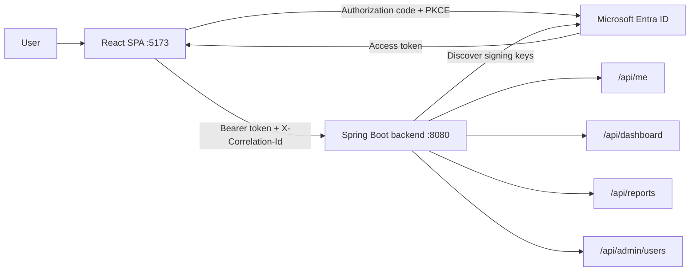
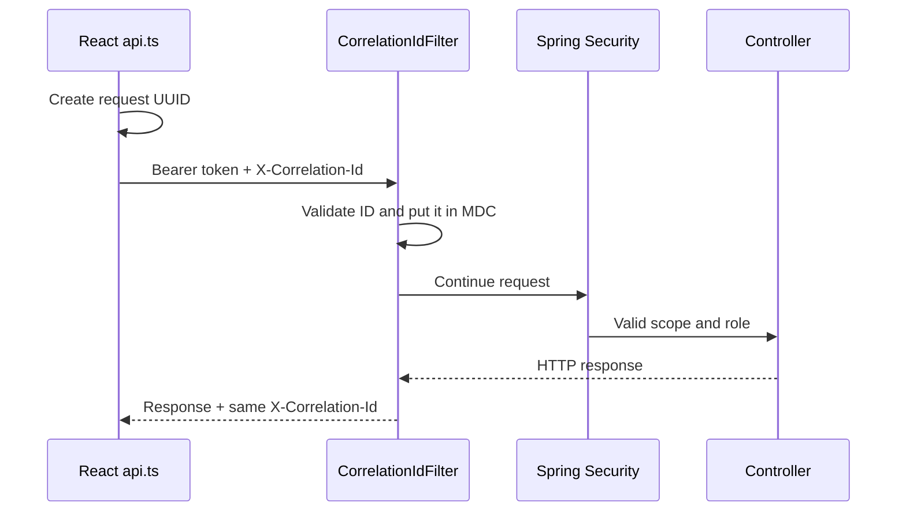

# Entra SSO React Spring Reference

A beginner-friendly, production-oriented Microsoft Entra SSO reference with one React SPA and one
Spring Boot backend application.

**Recommended GitHub repository name:** `entra-sso-react-spring-reference`

## What this repository demonstrates

- Java 25 and Spring Boot 4.1.1
- React 19, TypeScript, Vite, MSAL Browser, and MSAL React
- OAuth 2.0 authorization code flow with PKCE
- One backend that validates every received access token
- Entra delegated scope (`scp`) and application roles (`roles`)
- `/api/me` for UI identity, role, and functionality rendering
- `@PreAuthorize` authorization for dashboard, reports, and administrator endpoints
- Exact-origin CORS, stateless APIs, and no custom authentication endpoint
- End-to-end `X-Correlation-Id` propagation and correlation-aware request logging
- Spotless/google-java-format for Java and Prettier for the React application
- Automated tests for `401`, `403`, roles, CORS, `/api/me`, and successful requests

## Simplified architecture



There is intentionally no Spring `/login`, `/authenticate`, or token-issuing endpoint. React uses
MSAL to sign in with Entra. Spring Boot is an OAuth2 resource server: its security filter validates
the access token before a protected controller executes.

Read [docs/architecture.md](docs/architecture.md) for the detailed sequence.

## Repository layout

```text
backend/
  src/main/java/com/example/entrasso/
    EntraSsoApplication.java
    security/                       JWT, CORS, role conversion, and /api/me
    logging/                        Correlation-ID filter and HTTP request logs
    api/                            Dashboard, reports, and admin endpoints
  src/main/resources/
    application.yml                Security and role configuration
    logback-spring.xml             Six-field JSON console logging
  src/test/                         Security and role-flow tests
frontend/                           React and MSAL UI
docs/                              Entra setup, architecture, flows, troubleshooting
```

## Endpoint authorization

Every `/api/**` request first requires the delegated `access_as_user` scope. The controller then
applies the endpoint-specific role rule.

| Endpoint | Required app role | Purpose |
|---|---|---|
| `GET /api/me` | No additional role | Return the validated user's roles and UI functionality |
| `GET /api/dashboard` | `APP_USER`, `APP_MANAGER`, or `APP_ADMIN` | Dashboard example |
| `GET /api/reports` | `APP_MANAGER` or `APP_ADMIN` | Reports example |
| `GET /api/admin/users` | `APP_ADMIN` | Administrator example |
| `GET /actuator/health` | Public | Health probe without sensitive details |

Hiding a React menu item is only a usability feature. Spring Security remains the authoritative
enforcement point if a user calls a hidden endpoint manually.

## Prerequisites

- A Microsoft Entra workforce tenant in which you can create app registrations and assign users
- Java 25
- Maven 3.9+ or the included Maven Wrapper
- Node.js 22.12+ and npm
- Three test users, or one user whose role you change between tests

Run `java -version` and confirm it reports Java 25. If multiple JDKs are installed, set `JAVA_HOME`
to Java 25 in the terminal that runs Maven.

A personal Microsoft account alone is not a workforce tenant. Create or use a tenant and invite
the personal account as a guest if needed.

## 1. Configure Microsoft Entra ID

Follow [docs/entra-setup.md](docs/entra-setup.md) for the click-by-click beginner guide. You will
create:

1. One API app registration exposing `access_as_user`.
2. Three API app roles: `APP_USER`, `APP_MANAGER`, and `APP_ADMIN`.
3. One SPA app registration with redirect URI `http://localhost:5173`.
4. A delegated SPA permission to `api://<API_CLIENT_ID>/access_as_user`.
5. Test-user role assignments on the API enterprise application.

Record:

| Value | Used by |
|---|---|
| Directory (tenant) ID | React and Spring Boot |
| SPA application (client) ID | React only |
| API application (client) ID | React scope and backend audience |

Do not create a client secret for the SPA. Browser applications cannot protect secrets.

## 2. Configure and start the backend

```bash
cd backend

export ENTRA_TENANT_ID='<directory-tenant-id>'
export ENTRA_API_CLIENT_ID='<api-application-client-id>'
export UI_ORIGIN='http://localhost:5173'

./mvnw verify
./mvnw spring-boot:run
```

The application starts on `http://localhost:8080`. Check:

```text
http://localhost:8080/actuator/health
```

The relevant JWT configuration is:

```yaml
spring:
  security:
    oauth2:
      resourceserver:
        jwt:
          issuer-uri: https://login.microsoftonline.com/${ENTRA_TENANT_ID}/v2.0
          audiences: ${ENTRA_API_CLIENT_ID}
```

Spring uses the tenant metadata and signing keys to validate the signature, issuer, audience,
expiry, and not-before time.

## 3. Configure and start React

In another terminal:

```bash
cd frontend
cp .env.example .env.local
```

Edit `.env.local`:

```dotenv
VITE_ENTRA_TENANT_ID=<directory-tenant-id>
VITE_ENTRA_SPA_CLIENT_ID=<spa-application-client-id>
VITE_ENTRA_API_CLIENT_ID=<api-application-client-id>
VITE_API_BASE_URL=http://localhost:8080
```

Then run:

```bash
npm ci
npm run dev
```

Open `http://localhost:5173` and select **Sign in with Microsoft**.

## Correlation IDs and centralized logging

Every React API call creates a UUID and sends it in `X-Correlation-Id`. The backend filter runs
before Spring Security, validates the value, places it in SLF4J MDC, returns it in the response,
and includes it in the completion log. This also covers `401` and `403` responses. If a non-UI
client omits the header—or sends an unsafe value—the backend creates a UUID instead.



The frontend uses `src/logger.ts` as its single structured logging boundary. Authentication and
API modules log event names and safe scalar context without tokens. The backend's
`logback-spring.xml` writes one JSON object per line containing exactly `X-Correlation-Id`, `level`,
`message`, `logger`, `traceparent`, and `stack_trace`. It does not log query strings, request
bodies, claims, or authorization headers.

To test generation without a bearer token:

```bash
curl -i http://localhost:8080/actuator/health
```

To test propagation:

```bash
curl -i -H 'X-Correlation-Id: local-test-001' http://localhost:8080/actuator/health
```

If an instrumented client or gateway supplies a valid W3C `traceparent`, the filter adds it to MDC
and the JSON log. Without distributed-tracing instrumentation the property remains an empty
string. For centralized production ingestion, collect the backend's JSON standard output with the
deployment platform. Browser logs require an approved telemetry transport and consent policy; the
central logger is the one extension point for Application Insights or OpenTelemetry. See
[docs/observability.md](docs/observability.md).

## Formatting and quality checks

Backend formatting uses Spotless 3.9.0 with google-java-format 1.36.0. `verify` automatically runs
the formatting check:

```bash
cd backend
./mvnw spotless:apply   # format Java sources
./mvnw spotless:check   # check without changing files
./mvnw verify           # tests, package, and formatting check
```

Frontend formatting uses the exact Prettier version recorded in `package-lock.json`. TypeScript's
strict compiler remains the code-quality gate. The current TypeScript 7 compiler is newer than the
supported `typescript-eslint` peer range, so this repository does not force an incompatible ESLint
installation.

```bash
cd frontend
npm run format          # format frontend source/configuration
npm run format:check    # check without changing files
npm run check           # formatting check, strict typecheck, and production build
```

## 4. Test each role

| Assigned role | Dashboard | Reports | Admin users |
|---|---:|---:|---:|
| No app role | Hidden / `403` | Hidden / `403` | Hidden / `403` |
| `APP_USER` | `200` | `403` | `403` |
| `APP_MANAGER` | `200` | `200` | `403` |
| `APP_ADMIN` | `200` | `200` | `200` |

After changing a role assignment, sign out and sign in again so Entra issues a token containing the
new `roles` claim.

## Where JWT validation happens

[EntraSecurityConfiguration.java](backend/src/main/java/com/example/entrasso/security/EntraSecurityConfiguration.java)
configures `oauth2ResourceServer().jwt(...)`. On each protected request:

1. Spring reads the bearer token from the `Authorization` header.
2. `JwtDecoder` verifies signature, issuer, audience, and time claims.
3. The converter maps `scp` to `SCOPE_*` and `roles` to `ROLE_*`.
4. The filter chain requires `SCOPE_access_as_user`.
5. `@PreAuthorize` checks the endpoint's application role.
6. Only then does the controller method execute.

## Included flow examples

[docs/flow-examples.md](docs/flow-examples.md) covers:

1. Interactive sign-in and redirect handling
2. Silent access-token acquisition
3. `/api/me` and role-driven UI rendering
4. Dashboard, reports, and administrator requests
5. Missing or invalid token (`401`)
6. Valid token with insufficient permission (`403`)
7. Logout
8. Adding another protected endpoint

## Build verification

```bash
cd backend && ./mvnw verify
cd ../frontend && npm ci && npm run check
```

GitHub Actions runs both checks for pushes and pull requests.

## Troubleshooting

Use [docs/troubleshooting.md](docs/troubleshooting.md) for personal-account tenant errors, Vite
type-import errors, invalid issuer/audience errors, missing scopes or roles, CORS failures, redirect
URI mismatches, and the difference between `401` and `403`.

## Production checklist

- Rename `com.example` to a namespace you control.
- Use HTTPS redirect URIs and exact production CORS origins.
- Keep the issuer tenant-specific and validate only the intended API audience.
- Store environment configuration in the deployment platform; commit no secrets or tokens.
- Add domain authorization tests for every sensitive operation.
- Add rate limiting, auditing, monitoring, ingress controls, and incident-response procedures.
- Enable dependency review, Dependabot, secret scanning, push protection, private vulnerability
  reporting, and protected `main` checks.
- Keep access tokens out of logs, browser console output, URLs, local storage, and API responses.
- Configure a production log/telemetry collector and retention/redaction policy.
- Split into separately registered resource APIs only when service ownership or trust boundaries
  require it; each such API must validate its own audience.

## References

- [Microsoft identity platform](https://learn.microsoft.com/en-us/entra/identity-platform/)
- [SPA authorization code flow with PKCE](https://learn.microsoft.com/en-us/entra/identity-platform/v2-oauth2-auth-code-flow)
- [Microsoft Entra access-token claims](https://learn.microsoft.com/en-us/entra/identity-platform/access-token-claims-reference)
- [Microsoft Entra application roles](https://learn.microsoft.com/en-us/entra/identity-platform/howto-add-app-roles-in-apps)
- [Spring Security OAuth2 resource server](https://docs.spring.io/spring-security/reference/servlet/oauth2/resource-server/index.html)

## License

Apache License 2.0. See [LICENSE](LICENSE).
