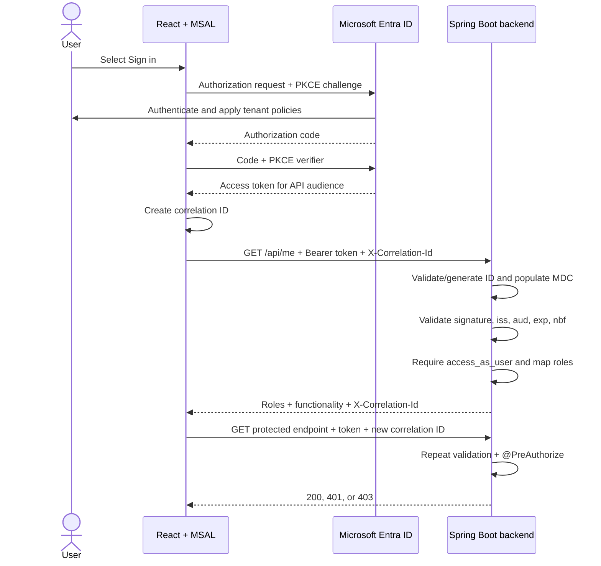
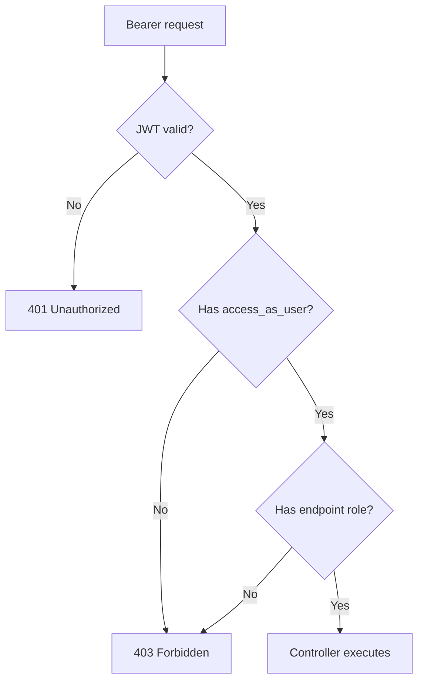

# Architecture and security design

## Responsibilities

| Component | Responsibility |
|---|---|
| React + MSAL | Start login, obtain an API access token, attach token/correlation headers, render UI hints |
| Microsoft Entra ID | Authenticate the user, apply tenant policies, issue signed tokens with scopes and roles |
| Spring Security | Validate the token and enforce the required delegated scope |
| Backend controllers | Enforce endpoint-specific app roles and return application data |
| Correlation filter | Validate or create the request ID, populate MDC, log completion, and echo the ID |

React is not an authorization boundary. Users can alter browser state, so every sensitive backend
method must enforce its own role requirement.

## End-to-end sequence

## Why there is no authentication controller

An endpoint accepting usernames and passwords would expand credential-handling risk and bypass
Entra capabilities such as MFA and Conditional Access. The SPA is a public OAuth client and uses
authorization code with PKCE. Neither React nor Spring needs a client secret for this delegated
user flow.

## JWT validation location

The Spring Security bearer-token filter extracts the `Authorization` header. Boot configures a
`JwtDecoder` from the tenant-specific issuer and expected audience. Before any controller runs, it
validates:

- Cryptographic signature and signing-key ID
- `iss` against the configured tenant issuer
- `aud` against the API application/client ID
- `exp` and `nbf` timestamps

After validation, the custom converter maps `scp` values to `SCOPE_*` authorities and `roles` to
`ROLE_*` authorities. Claim conversion is not token validation; it occurs after validation.

## Authorization layers

The scope means the SPA may call this API on behalf of the user. The app role decides which
business function that user may perform.

## `/api/me`

`/api/me` returns identity claims, roles, and configured UI functionality from the already
validated access token. It does not issue or return the bearer token. The UI uses this response to
hide irrelevant controls, but each controller still uses `@PreAuthorize`.

## CORS

CORS executes before bearer authentication so an unauthenticated browser preflight can succeed.
Only the configured React origin, expected methods, and
`Authorization`/`Content-Type`/`X-Correlation-Id`/`traceparent` headers are allowed. The backend
exposes `X-Correlation-Id` so browser code can read the effective response value. CORS does not
authenticate calls and does not affect non-browser clients.

## Logging and correlation boundary

`frontend/src/logger.ts` is the only direct browser-console logging boundary. `api.ts` creates one
UUID per request and records start/completion/failure events with that ID. The access token is
never supplied to the logger.

The backend `CorrelationIdFilter` executes before Spring Security. A caller value is accepted only
when it contains 1–128 letters, digits, dots, underscores, colons, or hyphens and starts with an
alphanumeric character. This prevents control-character log injection. Missing or invalid values
are replaced with a UUID. The filter puts the ID in SLF4J MDC inside a scoped block, ensuring it is
removed when processing finishes and cannot leak into another request handled by the same thread.
The same scope contains a valid incoming W3C `traceparent`, when present. `logback-spring.xml` uses
Spring Boot's structured encoder and `ApplicationJsonLogFormatter` to produce exactly the six
documented JSON properties on every log line.

See [observability.md](observability.md) for examples and deployment guidance.

## When to split the backend later

The single backend is the simplest design while the endpoints share ownership, deployment, and a
security boundary. If they later become independently governed services, give each resource API
its own Entra registration, audience, scope, deployment, and JWT validation. React would then
acquire the correct audience-specific token for each API.
