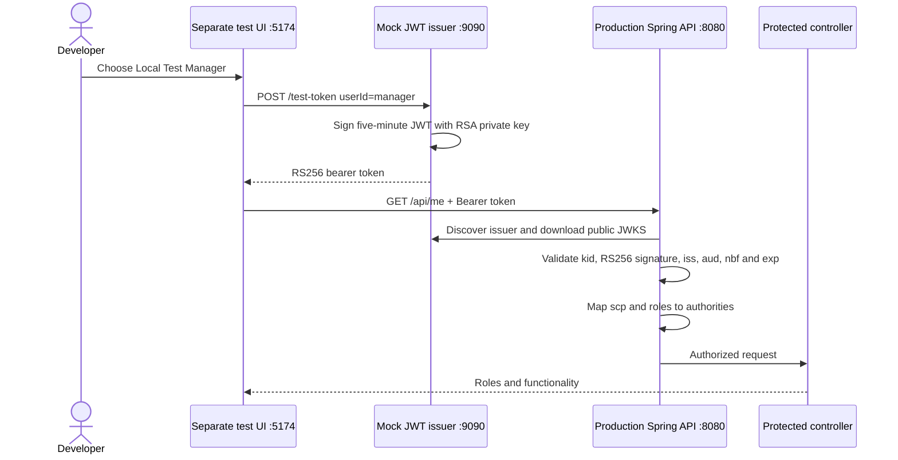

# Test JWT authorization before Microsoft Entra is available

This local test environment validates the production backend's bearer-token boundary without
placing mock authentication code in either production application. It consists of two separate
tools under `local-testing/`:

- `mock-jwt-issuer`: a loopback-only Spring Boot utility that owns an ephemeral RSA private key,
  publishes OIDC discovery/JWKS metadata, and issues short-lived tokens for fixed identities.
- `token-test-ui`: a separate React application that obtains one of those tokens and sends it to
  the production backend as an `Authorization: Bearer` credential.

The production React application remains MSAL-only. The production backend remains a normal
issuer-configured OAuth2 Resource Server and contains no mock decoder or signing key.

## Architecture



## What this tests

| Behavior | Local issuer | Microsoft Entra |
|---|---|---|
| Bearer header and security filter chain | Same production backend | Same production backend |
| Asymmetric signature and `kid` validation | Ephemeral RS256/JWKS | Entra signing keys/JWKS |
| Issuer, audience and timestamps | Yes | Yes |
| `scp` and `roles` conversion | Same production code | Same production code |
| `/api/me` and `@PreAuthorize` | Same production code | Same production code |
| User authentication, PKCE, MFA and consent | Not tested | Tested |
| Entra role assignment and Conditional Access | Not tested | Tested |

The local flow is therefore an API authentication/authorization test, not an SSO emulator. A final
real-Entra test remains mandatory.

## Prerequisites

- Java 25
- Node.js 22.12 or newer and npm
- Ports `9090`, `8080`, and `5174` available

Start the three components in the order below. Spring downloads discovery metadata during backend
startup, so the mock issuer must already be running.

## 1. Start the standalone issuer

From the repository root:

```bash
./backend/mvnw -f local-testing/mock-jwt-issuer/pom.xml spring-boot:run
```

Verify its public metadata:

```bash
curl http://localhost:9090/.well-known/openid-configuration
curl http://localhost:9090/oauth2/jwks
```

The JWKS response contains public values such as `n`, `e`, `kid`, and `alg`. It never contains the
RSA private value `d`. A new key is generated on every restart, deliberately invalidating tokens
issued by the previous process.

## 2. Start the unchanged production backend against the local issuer

In a second terminal:

```bash
cd backend

export OAUTH2_ISSUER_URI='http://localhost:9090'
export OAUTH2_AUDIENCE='local-spring-api'
export UI_ORIGIN='http://localhost:5174'

./mvnw spring-boot:run
```

These environment variables override the Entra issuer/audience configuration. No local profile,
custom decoder, shared secret, or test controller is loaded into the backend.

## 3. Start the separate React test UI

In a third terminal:

```bash
cd local-testing/token-test-ui
npm ci
npm run dev
```

Open `http://localhost:5174`. The amber warning identifies the application as a local utility.
Choose a fixed test identity and select **Get token and call /api/me**.

| Test identity | Token role | Dashboard | Reports | Admin users |
|---|---|---:|---:|---:|
| Local Test User | `APP_USER` | `200` | `403` | `403` |
| Local Test Manager | `APP_MANAGER` | `200` | `200` | `403` |
| Local Test Administrator | `APP_ADMIN` | `200` | `200` | `200` |

The test UI keeps the access token only in memory. **Copy bearer token** is available for explicit
local Postman or command-line testing; never paste a real Entra token into this tool.

## Command-line token testing

With `jq` installed, obtain a manager token directly from the issuer:

```bash
LOCAL_TOKEN="$(curl --silent \
  --request POST \
  --header 'Content-Type: application/json' \
  --data '{"userId":"manager"}' \
  http://localhost:9090/test-token | jq --raw-output '.accessToken')"
```

Pass it to the production backend exactly as React or MSAL would:

```bash
curl --include \
  --header "Authorization: Bearer ${LOCAL_TOKEN}" \
  --header 'X-Correlation-Id: local-manager-curl-test' \
  http://localhost:8080/api/me
```

Expected manager behavior:

```bash
curl --include --header "Authorization: Bearer ${LOCAL_TOKEN}" \
  http://localhost:8080/api/reports

curl --include --header "Authorization: Bearer ${LOCAL_TOKEN}" \
  http://localhost:8080/api/admin/users
```

The reports request returns `200`; the administrator request returns `403`.

## Issued token shape

Tokens contain the claims consumed from real Entra access tokens:

```json
{
  "iss": "http://localhost:9090",
  "aud": "local-spring-api",
  "sub": "local-manager",
  "oid": "local-manager",
  "tid": "local-test-tenant",
  "preferred_username": "manager@local.test",
  "name": "Local Test Manager",
  "scp": "access_as_user",
  "roles": ["APP_MANAGER"],
  "iat": 1788140000,
  "nbf": 1788139995,
  "exp": 1788140300,
  "jti": "unique-token-id"
}
```

The issuer accepts only `user`, `manager`, or `admin`. It does not accept caller-provided claims or
arbitrary role names.

## Useful rejection tests

- Stop/restart the issuer and reuse an old token: `401` because its `kid` and signature are stale.
- Set `OAUTH2_AUDIENCE` to another value: issued tokens receive `401`.
- Wait for the five-minute expiration: the token receives `401`.
- Call `/api/admin/users` with a manager token: valid authentication but insufficient role, `403`.
- Omit the bearer header: `401`.

## Return to Microsoft Entra

Stop the local issuer and test UI, then remove only the local overrides:

```bash
unset OAUTH2_ISSUER_URI OAUTH2_AUDIENCE UI_ORIGIN
```

Set the normal `ENTRA_TENANT_ID` and `ENTRA_API_CLIENT_ID` values and start the production React UI
from `frontend/`. The backend falls back to the tenant-specific Entra issuer while all security and
controller code remains unchanged.

## Safety restrictions

- Both utilities are local testing aids and must never be deployed.
- The issuer binds to `127.0.0.1` and has no authentication of its own.
- Its private key exists only in process memory and is never returned or written to disk.
- Tokens last five minutes and are restricted to a fixed identity catalog.
- The test UI is separate from the production MSAL bundle and stores tokens only in memory.
- Production environments must set an allow-listed Entra issuer and API audience explicitly.
