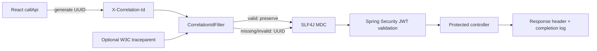

# Logging, correlation, and formatting

## What is implemented

| Layer | Implementation | Responsibility |
|---|---|---|
| React | `src/logger.ts` | One structured browser logging API and one replaceable output boundary |
| React HTTP | `src/api.ts` | Creates a UUID, sends it, reads the effective response ID, and logs request outcome |
| Spring HTTP | `CorrelationIdFilter` | Reuses/creates a correlation ID, validates traceparent, populates MDC, echoes the ID, and logs completion |
| Spring logging | `logback-spring.xml` | Writes the approved six-field JSON schema to standard output |
| Java format | Spotless + google-java-format | Applies deterministic Java formatting and checks it during `verify` |
| UI format | Prettier | Applies deterministic TypeScript, TSX, CSS, HTML, JSON, and configuration formatting |

## Request lifecycle



The frontend creates a new correlation ID for each HTTP request. This gives each `/api/me`,
dashboard, reports, and administrator call a distinct searchable identity. If a future business
operation makes several HTTP calls and needs a parent identifier, add a separate operation ID;
do not reuse one request ID concurrently.

## Example output

The browser emits structured objects similar to:

```json
{
  "timestamp": "2026-08-26T10:15:30.123Z",
  "level": "info",
  "event": "api.request.completed",
  "context": {
    "correlationId": "778c2e8b-f256-47b4-af7e-a9187f79ec08",
    "method": "GET",
    "path": "/api/dashboard",
    "status": 200,
    "durationMs": 48
  }
}
```

The matching backend line is a JSON document. All six keys are always present; `traceparent` and
`stack_trace` are empty when the event has neither distributed trace context nor an exception:

```json
{
  "X-Correlation-Id": "778c2e8b-f256-47b4-af7e-a9187f79ec08",
  "level": "INFO",
  "message": "HTTP GET /api/dashboard completed with status=200 in 45 ms",
  "logger": "com.example.entrasso.logging.CorrelationIdFilter",
  "traceparent": "00-4bf92f3577b34da6a3ce929d0e0e4736-00f067aa0ba902b7-01",
  "stack_trace": ""
}
```

`ApplicationJsonLogFormatter` uses Spring Boot's JSON writer rather than string concatenation, so
messages and stack traces are escaped correctly. Startup events and non-HTTP background logs have
an empty `X-Correlation-Id`. A valid W3C version-00 `traceparent` supplied by tracing
instrumentation is propagated; absent, malformed, or all-zero trace identifiers become an empty
value and are never treated as authentication data.

## Production collection

Backend applications write the custom JSON format to standard output. Let the runtime platform or
an agent ship these lines to the approved central store. Configure the collector to parse one JSON
document per line and use `X-Correlation-Id` and `traceparent` as indexed fields. The schema is
defined in `ApplicationJsonLogFormatter`; changing it is an API change for log consumers.

The frontend currently writes structured objects to the browser console through one logger.
Browser console output is not a durable central log store. To send selected events to Application
Insights, OpenTelemetry, or another provider, replace the output operation inside `logger.ts` (or
inject a sink there) and retain these controls:

- Never send access/ID tokens, authorization headers, passwords, secrets, or complete MSAL objects.
- Minimize personal data and document a lawful purpose, consent behavior, retention, and access.
- Batch and rate-limit telemetry so failures cannot degrade the application.
- Keep telemetry endpoint credentials out of the SPA; browser-visible configuration is public.
- Treat correlation IDs as diagnostic metadata, not authentication or authorization evidence.

## Formatting commands

```bash
cd backend
./mvnw spotless:apply
./mvnw verify

cd ../frontend
npm ci
npm run format
npm run check
```

CI runs Maven `verify` (including `spotless:check`) and `npm run check` (including
`prettier --check`, strict TypeScript compilation, and the Vite production build).
