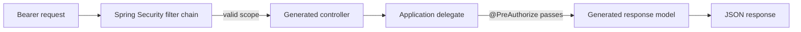

# OpenAPI-first Spring API generation

The backend uses OpenAPI Generator rather than manually maintained Spring MVC controllers. Swagger
is the older name commonly used for this ecosystem; the contract itself uses OpenAPI 3.0.3.

## Source of truth

`backend/src/main/openapi/entra-sso-api.yaml` defines:

- `/api/me`, `/api/dashboard`, `/api/reports`, and `/api/admin/users`
- HTTP methods, operation IDs, descriptions, and response codes
- The `access_as_user` OAuth 2.0 security requirement
- User-access, dashboard, reports, and administrator response schemas

Do not add `@GetMapping` or response DTO classes manually for these operations. Change the contract
and regenerate instead.

## Build-time generation

OpenAPI Generator 7.25.0 runs automatically in Maven's `generate-sources` phase with its Spring
Boot 4 and delegate-pattern options enabled:

```bash
cd backend
./mvnw generate-sources
```

`compile`, `test`, `package`, and `verify` all run `generate-sources` automatically. The generated
output is placed below `backend/target/generated-sources/openapi` and is intentionally excluded
from Git.

The contract currently generates:

| Generated HTTP class      | Operations                               |
| ------------------------- | ---------------------------------------- |
| `UserAccessApiController` | `GET /api/me`                            |
| `BusinessApiController`   | `GET /api/dashboard`, `GET /api/reports` |
| `AdminUsersApiController` | `GET /api/admin/users`                   |

It also generates `*Api`, `*ApiDelegate`, `DashboardResponse`, `ReportsResponse`,
`UserAccessResponse`, and `AdminUser`.

## Handwritten application code

Only business behavior remains in source-controlled Java classes:

| Application delegate           | Responsibility                                         |
| ------------------------------ | ------------------------------------------------------ |
| `UserAccessApiDelegateService` | Read validated JWT claims and resolve UI functionality |
| `BusinessApiDelegateService`   | Return dashboard and report examples                   |
| `AdminUsersApiDelegateService` | Return administrator user projections                  |

The generated controllers discover these Spring beans and invoke them. `@PreAuthorize` remains on
the protected delegate methods, so controller generation does not weaken role authorization.

## Request processing order



JWT signature, issuer, audience, and timestamp validation still occurs before the generated
controller. OpenAPI Generator creates the HTTP adapter; it does not replace Spring Security.

## Change workflow

When adding or changing an operation:

1. Edit `src/main/openapi/entra-sso-api.yaml`.
2. Run `./mvnw generate-sources` or `./mvnw compile`.
3. Implement the generated delegate method in `src/main/java`.
4. Put the endpoint's role rule on the delegate method with `@PreAuthorize`.
5. Add or update MockMvc authorization and response-contract tests.
6. Run `./mvnw verify`.

Never edit files inside `target/generated-sources/openapi`; Maven can replace them at any time.

## Swagger UI

This setup generates server code from the OpenAPI document but does not expose Swagger UI from the
running production API. That is deliberate: documentation exposure should be an explicit
deployment decision. The YAML contract can still be imported directly into Swagger Editor,
Postman, API-management products, or client-generation pipelines.
